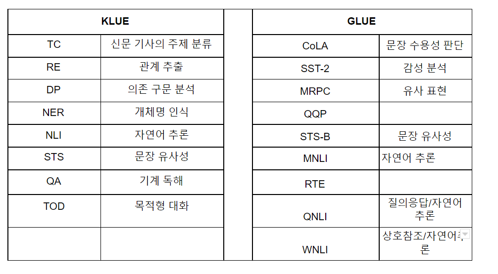
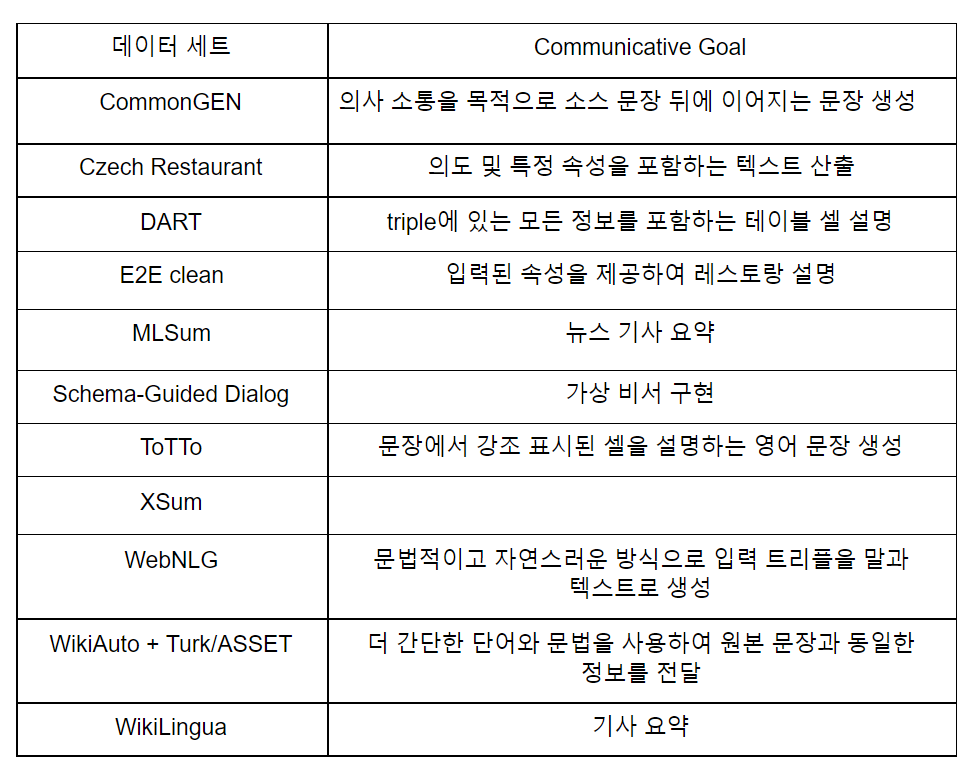

# NLUvsNLG

자연어 처리는 그동안 인간이 쌓아올린 방대한 양의 지식을 빠르게 분석하고 이해하는 작업이면서,  그렇게 이해한 모델을 자동으로 생성하는 작업이다. 그런데 자연어 이해 영역이 사람이 문자를 이해하는 것과 완전히 동일하지는 않다. Alex Wang(2019)에서는 인간의 능력은 일반적이고 유연하며 강력한 반면 NLU 모델은 특정 작업을 위해 설계되었으며 특정 도메인 외 데이터와 씨름하는 것으로 설명하고 있다. 그러므로 자연어 처리 모델은 단순한 입력과 출력 이상의 작업을 위해 통일된 모델을 개발하는 것이 중요하다. 자연어 생성도 마찬가지로  사람의 언어 또는 비언어적인 입력으로 받아서 사람이 이해할 수 있는 출력을 자동으로 생성하는 작업 (Reiter and Dale, 2000)이다.
모델의 성능을 테스트 할 수 있는 벤치마크 데이터 세트를 통해서 자연어 이해의 과제와 생성의 과제를 분류해 보면 다음과 같다.

한국어 자연어 이해의 과제   영어 자연어 이해의 과제     

영어 자연어 생성의 과제 예시는 The GEM Benchmark 데이터 세트를 통해 구체적으로 확인할 수 있다.    

참고자료        
Ehud Reiter and Robert Dale. 2000. Building natural language generation systems. Cambridge university press        
Alex Wang, Amanpreet Singh, 2019, Julian Michael, Felix Hill, Omer Levy, and Samuel R. Bowman. GLUE: A multi-task benchmark and analysis platform for natural language understanding. In International Conference on Learning Representations.              
Park, Sungjoon and Moon, Jihyung and Kim, Sungdong and Cho, Won Ik and Han, Jiyoon and Park, Jangwon and Song, Chisung and Kim, Junseong and Song, Yongsook and Oh, Taehwan and Lee, Joohong and Oh, Juhyun and Lyu, Sungwon and Jeong, Younghoon and Lee, Inkwon and, Seo, Sangwoo and  Lee, Dongjun and Kim, Hyunwoo and  Lee, Myeonghwa and Jang, Seongbo and Do, Seungwon and Kim, Sunkyoung and Lim, Kyungtae and Lee, Jongwon and Park, Kyumin and Shin, Jamin and Kim, Seonghyun and Park,  Lucy and Oh, Alice and Ha, Jung-Woo and Cho, Kyunghyun. (2021). KLUE: Korean Language Understanding Evaluation. arXiv:2105.09680v3             
Sebastian Gehrmann, Tosin Adewumi, Karmanya Aggarwal,Pawan Sasanka Ammanamanchi, Aremu Anuoluwapo, Antoine Bosselut, Khyathi Raghavi Chandu, Miruna Clinciu, Dipanjan Das, Kaustubh D. Dhole,Wanyu Du, Esin Durmus, Ondrej Dušek,  Chris Emezue, Varun Gangal,Cristina Garbacea, Tatsunori Hashimoto, Yufang Hou, Yacine Jernite, Harsh Jhamtani,Yangfeng Ji, Shailza Jolly, Mihir Kale, Dhruv Kumar, Faisal Ladhak, Aman Madaan,Mounica Maddela, Khyati Mahajan, Saad Mahamood,Bodhisattwa Prasad Majumder,Pedro Henrique Martins, Angelina McMillan-Major, Simon Mille, Emiel van Miltenburg,Moin Nadeem, Shashi Narayan, Vitaly Nikolaev, Rubungo Andre Niyongabo, Salomey Osei, Ankur Parikh, Laura Perez-Beltrachini, Niranjan Ramesh Rao, Vikas Raunak, Juan Diego Rodriguez, Sashank Santhanam, João Sedoc, Thibault Sellam, Samira Shaikh, Anastasia Shimorina, Marco Antonio Sobrevilla Cabezudo, Hendrik Strobelt, Nishant Subramani, Wei Xu,Diyi Yang, Akhila Yerukola, Jiawei Zhou, (2021). The GEM Benchmark: Natural Language Generation, its Evaluation and Metrics, arXiv:2102.01672v3                  

